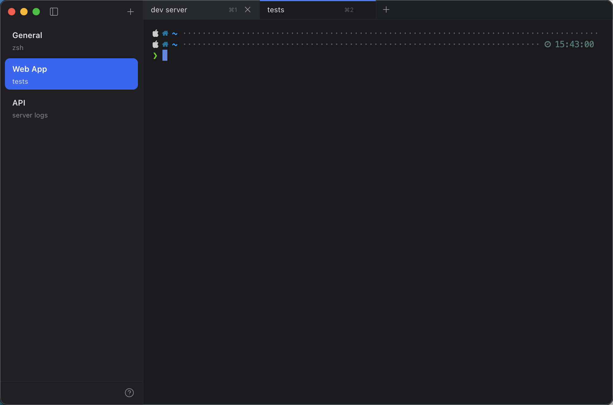
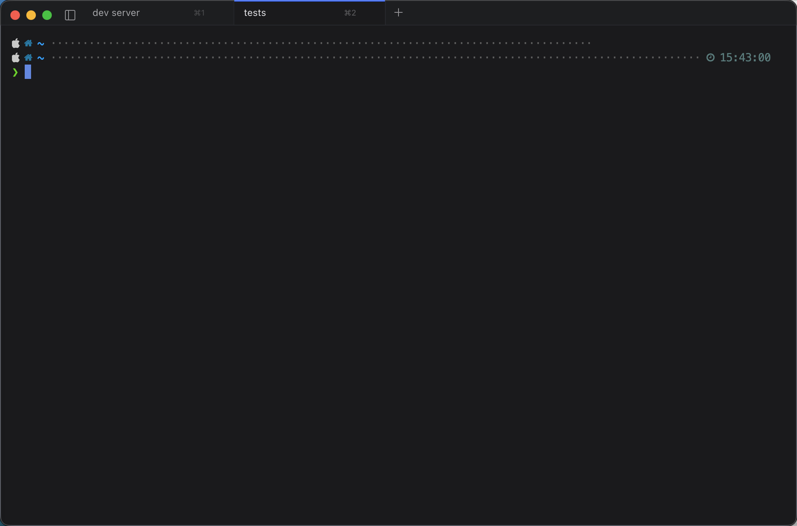
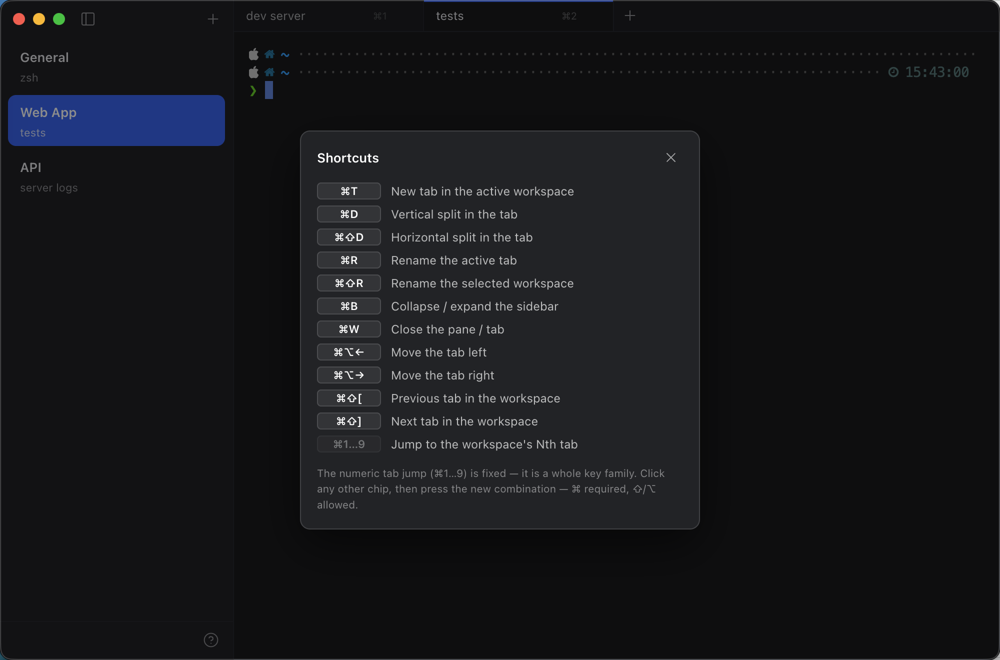

# hyper-workspaces

[cmux](https://cmux.com)-style workspaces for [Hyper](https://hyper.is): a left
sidebar groups tabs into workspaces; the strip at the top of the terminal shows
only the selected workspace's tabs.



<details>
<summary>More screenshots</summary>

| Collapsed sidebar | Shortcuts modal |
| --- | --- |
|  |  |

</details>

## Features

- **Workspace sidebar**: blocks with the workspace name + active tab title;
  the selected one becomes a blue pill. Collapsible (`⌘B` or the toggle
  button) and resizable by dragging its right edge (180–420px).
- **Per-workspace tab strip**: only the selected group's tabs, with
  per-workspace `⌘1..9` badges, an activity indicator and hover close buttons.
- **Own sessions**: every workspace starts with a tab of its own; persisted
  workspaces are materialized on boot; closing the last tab closes the
  workspace.
- **Drag & drop**: drag tabs to reorder (via
  [hyper-reorderable-tabs](https://github.com/kevinmarrec/hyper-reorderable-tabs),
  optional) or drop them onto a block to move them across workspaces; drag
  blocks to reorder workspaces.
- **Rename via modal**: `⌘R` renames the active tab (persisted, overrides the
  shell title; empty restores it), `⌘⇧R` renames the workspace. Double-click
  works too.
- **Shortcuts modal** on the `?` icon in the footer, with click-to-rebind for
  the plugin-owned shortcuts.
- State (workspaces, assignments, titles, width, collapse, shortcuts) persists
  in `state.json` next to the plugin (git-ignored).

## Install

As a Hyper local plugin:

```bash
git clone https://github.com/djalmajr/hyper-workspaces \
  ~/.hyper_plugins/local/hyper-workspaces
```

In `~/.hyper.js`:

```js
localPlugins: ['hyper-workspaces'],
```

### Required keymaps

Some plugin shortcuts collide with Hyper's native menu accelerators and must
be unbound in the `keymaps` block of `~/.hyper.js` (otherwise the menu
swallows the keys before the plugin sees them):

```js
keymaps: {
  // ⌘T / ⌘D / ⌘⇧D / ⌘W become plugin actions (new tab in workspace, splits, close pane)
  'tab:new': '',
  'pane:splitRight': '',
  'pane:splitDown': '',
  'pane:close': '',
  // ⌘R / ⌘⇧R rename tab/workspace (Reload stays available in the View menu)
  'window:reload': '',
  'window:reloadFull': '',
  // ⌘1..9 jump between the current workspace's tabs
  'tab:jump:prefix': '',
},
```

## Shortcuts

All shortcuts are rebindable from the shortcuts modal (`?` icon in the
sidebar footer): click a chip, then press the new combination — `⌘` required,
`⇧`/`⌥` allowed. The only fixed ones (dimmed in the modal) are the
tab-switching keys.

| Shortcut (default) | Action |
| --- | --- |
| `⌘T` | new tab in the active workspace |
| `⌘D` | vertical split in the tab |
| `⌘⇧D` | horizontal split in the tab |
| `⌘R` | rename the active tab |
| `⌘⇧R` | rename the selected workspace |
| `⌘B` | collapse / expand the sidebar |
| `⌘W` | close the pane / tab |
| `⌘⌥←` / `⌘⌥→` | move the tab left / right |
| `⌘1…9` (fixed) | jump to the workspace's Nth tab |
| `⌘⇧[` / `⌘⇧]` (fixed) | previous / next tab |

## Notes

- Chrome colors (sidebar/strip/selection) are a fixed cmux palette; the
  terminal background is overridden to `#1b1c1f` — your theme's ANSI colors
  and foreground are kept.
- Drag-to-reorder for tabs uses the `hyper-reorderable-tabs` reducer; without
  it installed the feature silently disables (everything else works).
- Tested with Hyper 3.4.1 on macOS.

## License

[MIT](LICENSE)
